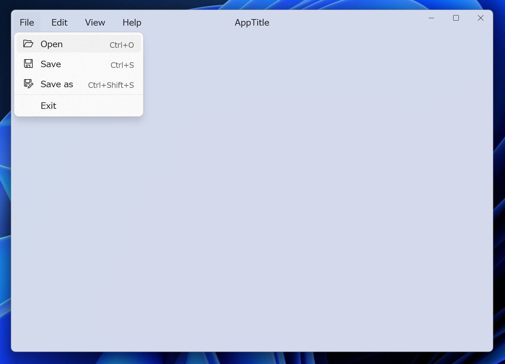

# NetPy
This repository is an example of a small WinUI app.



## Development command examples

### Run an application
```ps1
dotnet run start --project .\NetPy\NetPy.csproj
```

### Install a package
```ps1
dotnet add .\NetPy\NetPy.csproj package <Package name>
```

### Publish an application
```ps1
dotnet publish .\NetPy\NetPy.csproj  -c Release /p:Version=23.09.23
```
